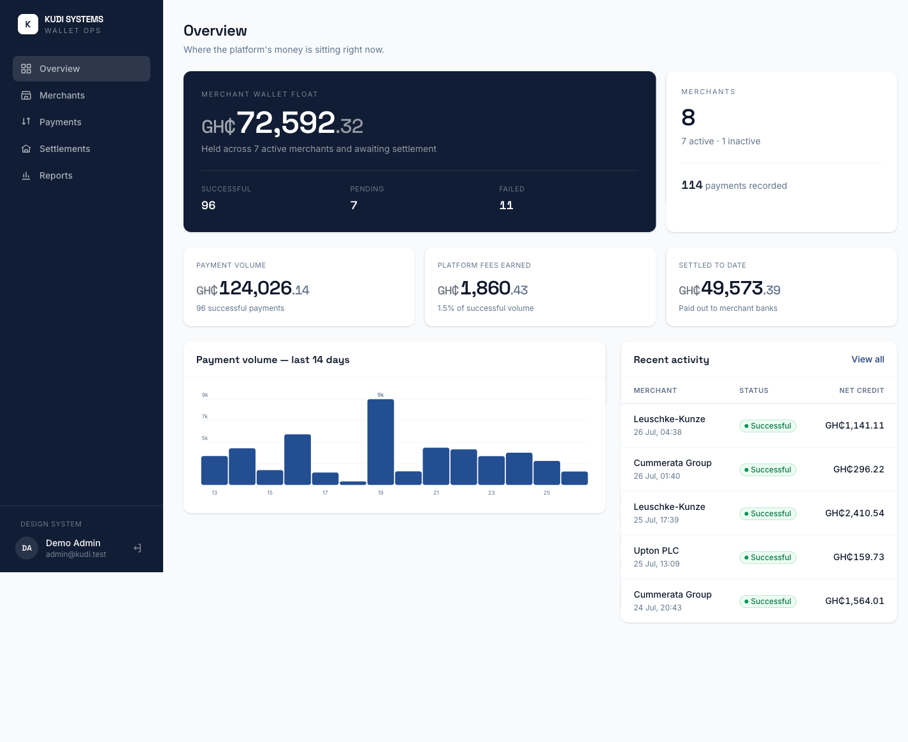
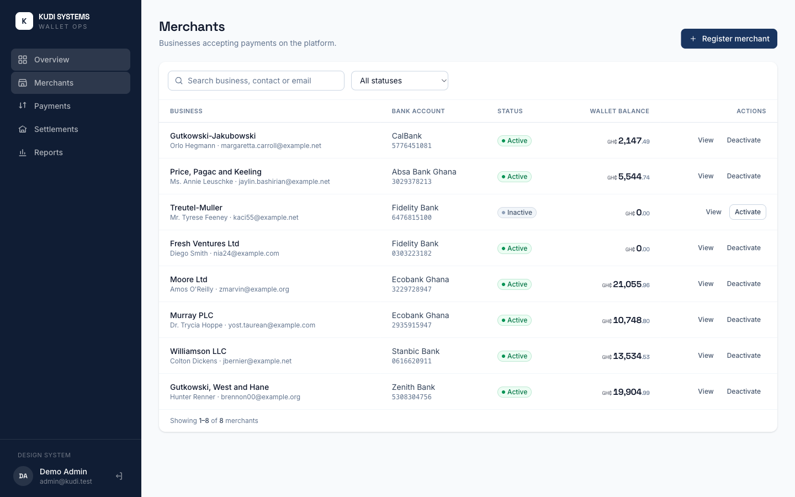
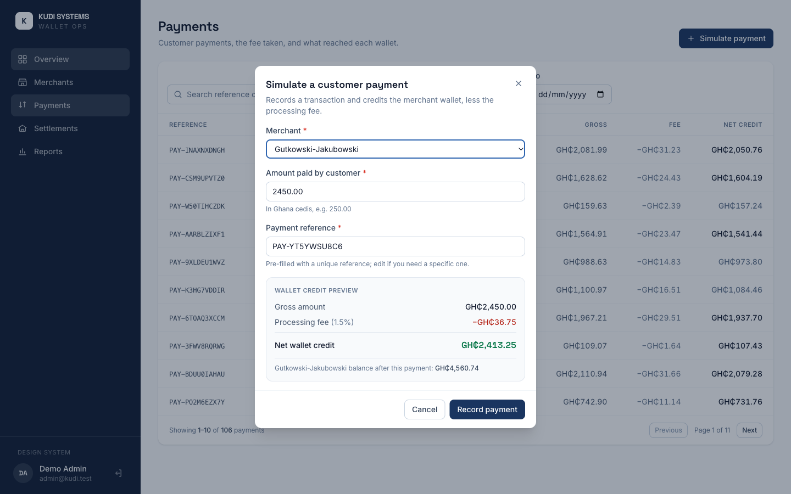
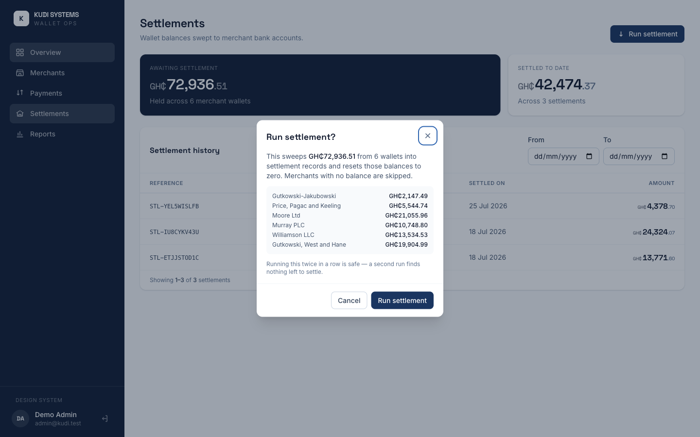

# Merchant Wallet & Settlement Dashboard

A merchant wallet and settlement dashboard for a fintech platform: register merchants, simulate
customer payments with a 1.5% processing fee, watch wallet balances accrue, and sweep those balances
into settlements.

**Frontend:** Vue 3 + TypeScript + Tailwind CSS v4 + Pinia
**Backend:** Laravel 12 + Sanctum (SPA session auth) + SQLite

> Take-home assessment for Kudi Systems — Senior Software Engineer (Frontend).

---

## Quick start (Docker)

```bash
docker compose up --build
```

Open **http://localhost:5173** and sign in with the seeded account (the login form is pre-filled with
it):

| Email | Password |
| --- | --- |
| `admin@kudi.test` | `password` |

The backend container self-configures on first boot: copies `.env`, generates the app key, creates the
SQLite file, then migrates and seeds. No further steps.

## Manual setup

Requirements: PHP ≥ 8.2, Composer, Node ≥ 20.

```bash
# Terminal 1 — backend on :8000
cd backend
composer install
cp .env.example .env
php artisan key:generate
touch database/database.sqlite
php artisan migrate --seed
php artisan serve

# Terminal 2 — frontend on :5173
cd frontend
npm install
cp .env.example .env
npm run dev
```

If you run the backend on a port other than 8000, set `VITE_API_URL` in `frontend/.env` to match, and
add the frontend origin to `SANCTUM_STATEFUL_DOMAINS` and `FRONTEND_URL` in `backend/.env`.

## Tests

```bash
cd backend && ./vendor/bin/pest
```

16 tests / 42 assertions covering fee calculation and rounding, ledger correctness, the
positive-balance-only rule, and settlement idempotency.

---

## Screens

| | |
| --- | --- |
|  |  |
| **Overview** — wallet float, volume, fees, settled, 14-day chart, recent activity | **Merchants** — search, status filter, wallet balances, activate/deactivate |
|  |  |
| **Simulate a payment** — live gross/fee/net preview and projected balance | **Run settlement** — itemises which wallets will be swept, and for how much |

More in [`docs/screenshots/`](docs/screenshots): merchant detail, transaction list, settlement
history, reports, the design-system page, and a mobile view.

---

## What the seed data gives you

Seeding is built to exercise every UI state without hand-crafting data:

- **8 merchants** — 6 with unsettled balances, 2 with prior settlement history, 1 deactivated, and 1
  brand-new with no activity at all (so you can see empty states).
- **~114 transactions** spread across the last 30 days in all three statuses (successful, pending,
  failed).
- **Settlement history** with matching ledger entries, so the settled/unsettled split is real rather
  than implied.

---

## Design decisions

### Money is never a float

Every amount is stored, transported, and computed as an **integer number of pesewas** (GHS minor
units). Conversion to a decimal happens only at the display edge. This removes the entire class of
rounding drift that shows up when currency is held in floats.

### The wallet balance is derived, not stored

There is no `wallet_balance` column. A merchant's balance is the sum of their `wallet_ledger_entries`
— payment credits are positive, settlement debits negative. A stored balance can silently disagree
with the history that explains it; a derived one cannot. Lists use a `withSum` subquery so this costs
one query, not N.

### The fee formula is duplicated on purpose — with the same integer arithmetic

The payment form previews the fee and net credit live, which means the formula exists in both PHP and
TypeScript. Rather than approximating with `gross * 0.015` on the frontend, both sides use the
identical integer expression:

```
fee = floor((gross * 150 + 5000) / 10000)     # 1.5%, rounded half-up
```

So the preview cannot disagree with what the API records over a floating-point edge case. This is
covered by a parameterised test including the exact `.5` boundaries.

### Only successful payments move money

A payment in `pending` or `failed` state creates a transaction record and **no ledger entry**. The
transaction list reflects this by de-emphasising the net-credit figure for those rows — the number is
what *would* have been credited, not what was.

### Settlement is idempotent by construction

`SettlementService` stamps `settled_at` on the entries it sweeps inside the same database transaction
that writes the settlement, and the offsetting debit is born already settled. A second run therefore
finds nothing outstanding rather than relying on a date window or a guard flag. Merchants with a zero
or negative balance are skipped, per the requirement that settlement moves *positive* balances.

### Design system before screens

A token layer (colour scale, type scale, radii, elevation) is defined in CSS and consumed as Tailwind
utilities, then six base components are built on it. Every screen composes those, which is why
spacing, focus treatment, and status colours are consistent without per-page tweaking. The
`/components` route documents the whole set.

### Visual direction

Deep navy carries the brand, with the Kudi red reserved as an accent rather than a UI colour. Money
figures get a deliberate treatment — Space Grotesk, tabular numerals, currency and decimals set
smaller so magnitude reads first — because reading balances is the app's whole job. Dark navy panels
are used only where the money position leads: the login panel, the wallet float, and a merchant's
balance.

---

## Assumptions

These weren't specified, so I chose and documented them:

1. **Single operator account.** This is an internal back-office tool, so there is one seeded staff
   user rather than merchant-facing logins. Merchants are records, not users.
2. **Simulated payments always succeed.** The payment form records a `successful` transaction. Pending
   and failed states exist in the schema, are seeded, and are handled throughout the UI — the
   `PaymentService` and API accept an explicit status — but the operator-facing form doesn't
   manufacture failures.
3. **Settlement is platform-wide.** "Run settlement" sweeps every merchant with a positive balance,
   which matches a daily batch process. It can be triggered manually any number of times.
4. **Settlement is a record, not a transfer.** No bank integration; a settlement records that a payout
   was instructed and resets the wallet.
5. **Currency is GHS**, single-currency, formatted `GH₵`.
6. **Inactive merchants cannot receive payments.** Enforced in `PaymentService` and reflected by
   excluding them from the payment form's merchant picker. Their existing balance and history remain
   intact and settleable.
7. **Fees are rounded half-up per transaction.** Summing per-transaction fees therefore differs by a
   pesewa or two from 1.5% of total volume. Per-transaction is the correct basis.

---

## API summary

All `/api/*` routes require an authenticated Sanctum session.

| Method | Endpoint | Purpose |
| --- | --- | --- |
| `GET` | `/sanctum/csrf-cookie` | Prime the XSRF cookie |
| `POST` | `/login` | Sign in, start session |
| `POST` | `/logout` | End session |
| `GET` | `/api/user` | Current user (401 when signed out) |
| `GET` | `/api/merchants` | List — `search`, `status`, `per_page`, `page` |
| `POST` | `/api/merchants` | Register a merchant |
| `GET` | `/api/merchants/{id}` | One merchant with wallet balance |
| `PATCH` | `/api/merchants/{id}/status` | Activate / deactivate |
| `GET` | `/api/merchants/{id}/transactions` | That merchant's payments, paginated |
| `GET` | `/api/merchants/{id}/settlements` | That merchant's settlements, paginated |
| `GET` | `/api/transactions` | List — `search`, `status`, `merchant_id`, `date_from`, `date_to` |
| `POST` | `/api/payments` | Simulate a payment (`merchant_id`, `amount` in pesewas, `reference`) |
| `GET` | `/api/settlements` | List — `merchant_id`, `date_from`, `date_to` |
| `POST` | `/api/settlements/run` | Sweep positive balances |
| `GET` | `/api/dashboard/summary` | Aggregates, status counts, recent activity, 14-day series |
| `GET` | `/api/exports/transactions` | CSV, honours the transaction list filters |
| `GET` | `/api/exports/settlements` | CSV, honours the settlement list filters |

---

## Accessibility

- Every input has a real `<label>` bound to it; errors set `aria-invalid` and are announced via
  `aria-describedby`.
- Focus is visible everywhere, with a light ring on dark surfaces where the brand ring would be too
  low-contrast.
- Modals trap Tab, close on Escape, move focus to the first field on open, and return focus to the
  trigger on close.
- Status is never colour alone — every badge pairs its colour with a dot and a text label.
- Tables carry captions; the chart ships an equivalent data table for screen readers.
- Toasts announce through a polite live region without stealing focus.
- A skip link is the first tab stop.
- All text/background pairs meet WCAG AA.

**Verified:** each of the three core journeys — register merchant, simulate payment, run settlement —
is completable using only the keyboard.

---

## Known limitations

Things I would do differently or additionally with more time, listed honestly:

- **No frontend test suite.** Backend business logic is covered by Pest; the frontend was verified by
  driving the real UI (including a keyboard-only pass with Playwright) rather than by committed
  component tests. A Vitest suite around `lib/fees.ts`, the stores, and the base components is the
  first thing I'd add.
- **No dark mode.** The token layer would support it, but the app commits to a single light theme.
- **Settlement is synchronous.** A real daily batch belongs in a queued job with a schedule; here it
  runs in-request so a reviewer can trigger it and see the result immediately.
- **No rate limiting or audit trail** on the settlement endpoint. In production, moving balances would
  be logged against the operator who triggered it.
- **The 1.5% fee is a constant**, not per-merchant pricing.
- **CSV export streams the full filtered set** with no row cap. Fine at this scale; it would need a
  queued export and a download link for very large ranges.
- **Merchant records cannot be edited or deleted** — only registered and activated/deactivated, which
  is what the brief asked for.
- **The Vite dev server is what Docker serves.** Appropriate for review; a production image would build
  static assets and serve them behind a web server.

---

## Tools used

Laravel 12, Pest, Vue 3, TypeScript, Vite, Tailwind CSS v4, Pinia, Vue Router, Axios, Docker Compose,
SQLite. Fonts are Space Grotesk and Inter. The chart is hand-rolled SVG — no charting dependency.

Built with AI assistance (Claude Code) for scaffolding, review, and verification. I understand and can
explain every part of the submitted code.
